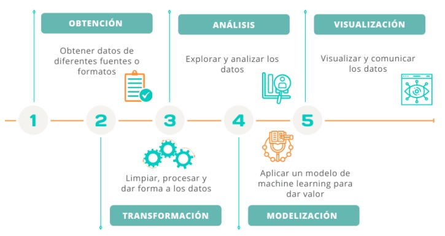

# TP Inicial
El mismo tiene la finalidad de servir como "warming-up" o entrada en calor para el resto de la materia. Además, el tema central es la Inteligencia Artificial en línea con el TP principal o central que se desarrollará posteriormente en la cursada.

## 📓 Enunciado
1. Investigar los conceptos de IA (Inteligencia Artificial), Machine Learning y Deep Learning.
2. Investigar las etapas de un proyecto de Data Science o Big Data. Un ejemplo se muestra a continuación:
   
   
   
3. Utilice una fuente de datos confiable respecto a temas de salud y seleccione un conjunto para analizar con algoritmos de Machine Learning. Mientras más datos tengas y de mejor calidad, más efectivo será el modelo analítico.
4. ¿Cuál es el objetivo que se desea lograr? ¿cuál es la variable a medir y cómo va a medirla?
5. Preparación de los datos: Este paso es importante, porque te permitirá eliminar los datos duplicados y que generen errores, y verificar cuál es la conexión y las características entre un dato y otro. La cantidad de datos que analicen es determinante, tiene que ser información balanceada. De lo contrario los resultados se inclinarán hacia un resultado y esto sería un error.
6. Elija el modelo de machine learning de acuerdo con el objetivo a alcanzar. ¿Necesitas predecir o clasificar? 
7. Entrenar el modelo: es donde comienza la magia; es importante manejar los datos de forma aleatoria, porque de esta manera se entrena al algoritmo para que haga los ajustes de forma automática.
8. Configurar los parámetros: Una vez que todo está listo y determinado el modelo que funciona, es momento de configurar los parámetros. Si arroja errores deben volver a entrenarlo, es parte del proceso.
9. Interpretación de resultados
10. Implementación del modelo en la nube para que otros puedan usarlo.


## 📆 Entregas

### Primer entrega
* Entregar la evidencia del repositorio en el que se trabajará.
* Documentar la investigación realizada acerca de IA, Machine Learning y Deep Learning.
* ¿Cuál es el objetivo que se desea lograr?
```
Ayudar a la comunidad a crear programas específicos para mejorar aspectos de salud mental
y prevención del suicidio en provincias que tengan mayor riesgo.
```
* ¿Cuál es la variable a medir y cómo va a medirla?
```
Se refinarán los datos provincia por provincia para clasificarlas según el potencial riesgo
de suicidios de cada una y tomando como posibles variables de ayuda a los porcentajes de
depresión y ansiedad de cada persona.
```
* Indicar el conjunto de datos a analizar y el modelo de ML a utilizar para su análisis (datos numéricos).
```
Se trabajará con el dataset de la UNC de niveles y predictores de depresión, ansiedad y
riesgo de suicidio durante la pandemia de COVID-19 en Argentina.
Por el momento se usará un modelo de aprendizaje supervisado.
```

### Segunda entrega
* Pasos seguidos en la preparación de los datos.
```
Codificamos numéricamente variables no númericas para poder usarlas en el entrenamiento
y refinar el dataset con las variables seleccionadas, que luego se dividió en 70% para entrenamiento
y 30% para pruebas usando train_test_split de sklearn.model_selection.
Luego se combinaron los datos de entrenamiento y prueba para asegurar que ambos conjuntos
tuvieran datos completos utilizando LabelEncoder de sklearn.preprocessing.
```
* Selección del modelo o modelos para lograr el objetivo propuesto.
```
Para alcanzar nuestro objetivo es importante elegir el modelo de machine learning adecuado,
ya que algunos modelos permiten predecir datos y otros clasificarlos. En nuestro caso, como necesitamos
clasificar las provincias el modelo que más se ajusta es el modelo de regresión logística.

```
* Entrenar el modelo o modelos para comparar cuál es mejor para el conjunto de datos y el objetivo pretendido.
```
Se observó que el modelo no obtuvo los mejores resultados en el entrenamiento y es posible que se
tengan que hacer cambios en el dataset o utilizar otro tipo de aprendizaje para el objetivo propuesto.
```

### Tercer entrega
* Establecer cuál es el mejor modelo o en caso de funcionar el elegido verificar los errores para corregir.
```
Luego de los pobres resultados que se tuvo utilizando regresión logística para la clasificación de
provincias, se inició una investigación rápida y se decidió utilizar clustering con K-Means.
```
* Configuración de parámetros.
```
Se hicieron pruebas con 5 y 6 clusters y luego al aplicar t-SNE para reducir la dimensionalidad se
utilizó una perplejidad en el rango de 5 a 30.
```
* Re-entrenamiento del modelo.
```
Las coordenadas resultantes se agregaron al conjunto de datos original.
El resultado es un gráfico que muestra cómo se distribuyen los casos en el espacio t-SNE,
coloreados según los grupos de K-Means.
```
```
5 clusters y 5 perplejidad
```

```
5 clusters y 30 perplejidad
```

```
6 clusters y 5 perplejidad
```

```
6 clusters y 30 perplejidad
```


### Cuarta entrega
* Interpretación de los resultados obtenidos con el modelo final seleccionado.
```
*
```
* Implementación en la nube para uso de otros interesados.
```
*
```
